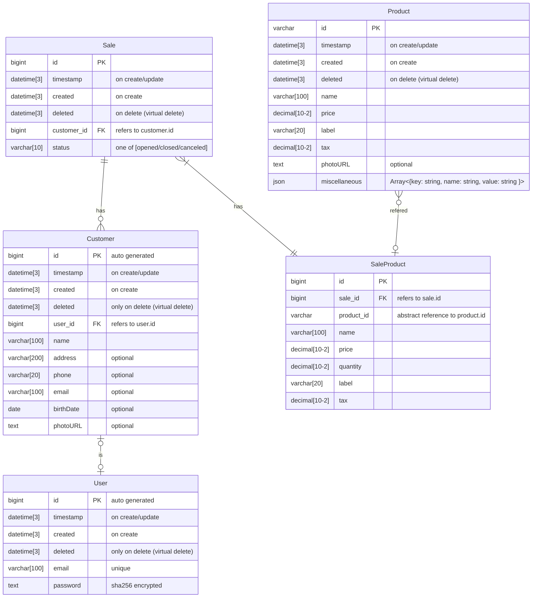

# inovia-backend

## Identified use-cases (CSU)

- user
  - login
  - refresh
- customer
  - getFullCustomer
  - addCustomer
  - editCustomer
  - removeCustomer
  - searchCustomer
- products
  - getFullProduct
  - addProduct
  - editProduct
  - removeProduct
  - searchProduct
- sales
  - getFullSale
  - addSale
  - editSale
  - removeSale
  - searchSale

## Data modeling (DER)

